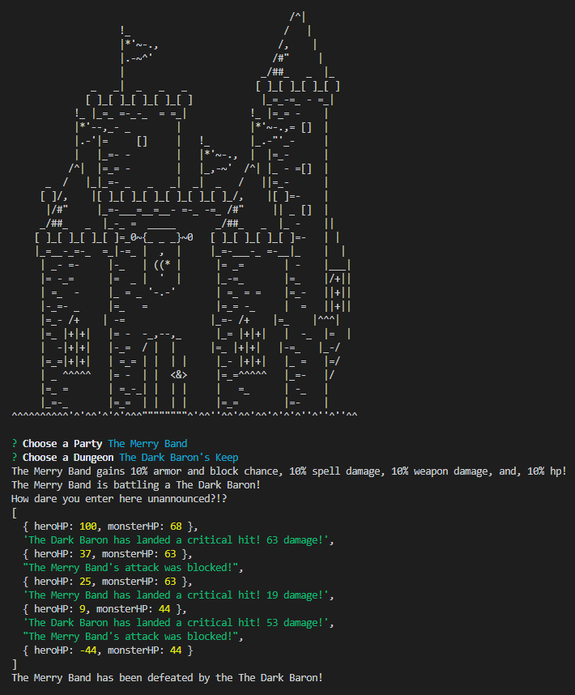
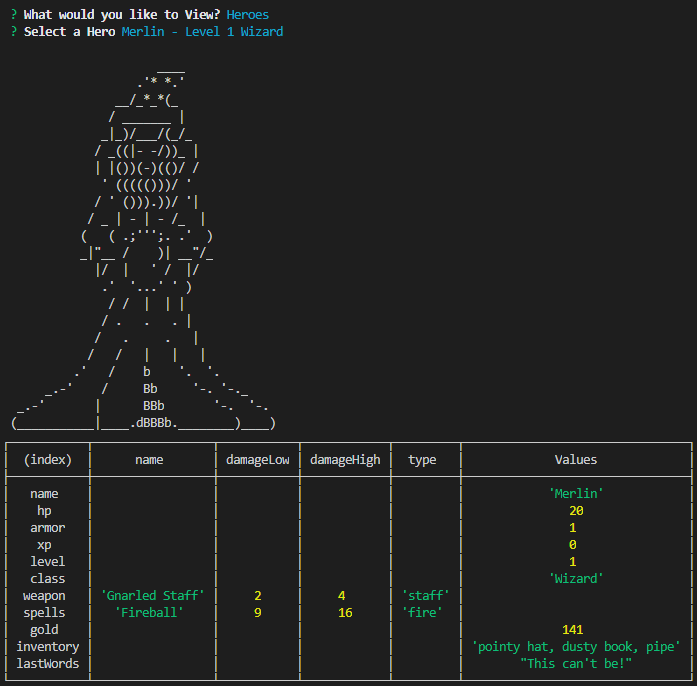

# Castles & Coding

Text-based role-playing in Node.js with MongoDB & Mongoose.

It makes extensive use of Javascript's prototype, while loops, and the Math object, to provide the basis of a classic tabletop roleplaying experience. 

```
As a longtime fan of tabletop gaming and computer roleplaying games, C&C is an homage 
to classic text-based roleplaying games of the past.
```

C&C is currently played entirely from the command line in your Node.js console. Future developments will include a front end inspired by MS-DOS era text-based games. 

## Text-Based Character & Monster Creation

Players can create personalized hero and monster characters complete with their own stats, equipment, inventory, and gold, using the provided functions, all from Node.js.

Monsters can also be randomly generated and will scale with the hero's stats - the stronger the hero, the more fearsome the monsters will be.

Players can also create Non-Player Characters with their own items, inventory, and things to say. 

## Combat and Loot System

Players can battle a specific hero against a specific monster one time, or battle against randomly-generated monsters over and over again until the hero is defeated.

Records of each battle are displayed in the console, and kept in the database for later viewing.

The "combat" system includes random chances for both heroes and monsters to block attacks or land critical hits. Monsters will drop gold, xp and items upon defeat, which will then transfer to the hero's inventory. Heroes can equip new items they gain from battles.

## Design and Raid Your Own Dungeons

Players can create their own dungeons, with unique descriptions, dungeon bosses, treasures, and minions.

Heroes can form a party in order to confront the powerful boss of a dungeon as a group. The party gains various bonuses based upon its makeup, then raids the dungeon as a group.  

## Optional - No DB required

A simplified version of the game, requiring no database, is also provided.

## Instructions

Simply clone the repository, and in the root directory
```
npm install
```

In your MongoDB shell, create a database called 
```
cncDb
```

Navigate to to ./seeds
```
node seed
```

Then, navigate to to ./CLI
```
node cnc
```

[Have fun storming the castle!](https://www.youtube.com/watch?v=AjUmULa0R-8)

## Character design

A tabletop RPG is less a of a game and more of a framework and set of tools - though seed data is provided for an example of play, you're encouraged to create your own heroes, monsters, and dungeons. You can modify the hero and monster stats and rewards calculations for a unique and endless experience. 

## Future Development
- Create a front-end UI styled after classic text-based role-playing computer games. 
 
- Turn-based structure to the game for a more laid-back user experience. 

- Robust documentation for all aspects of how to play the game.


