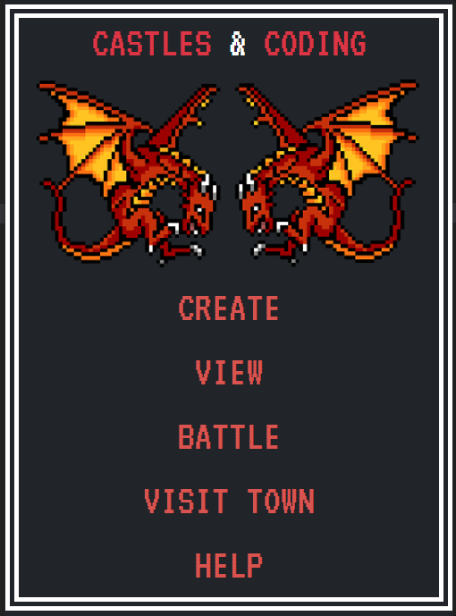
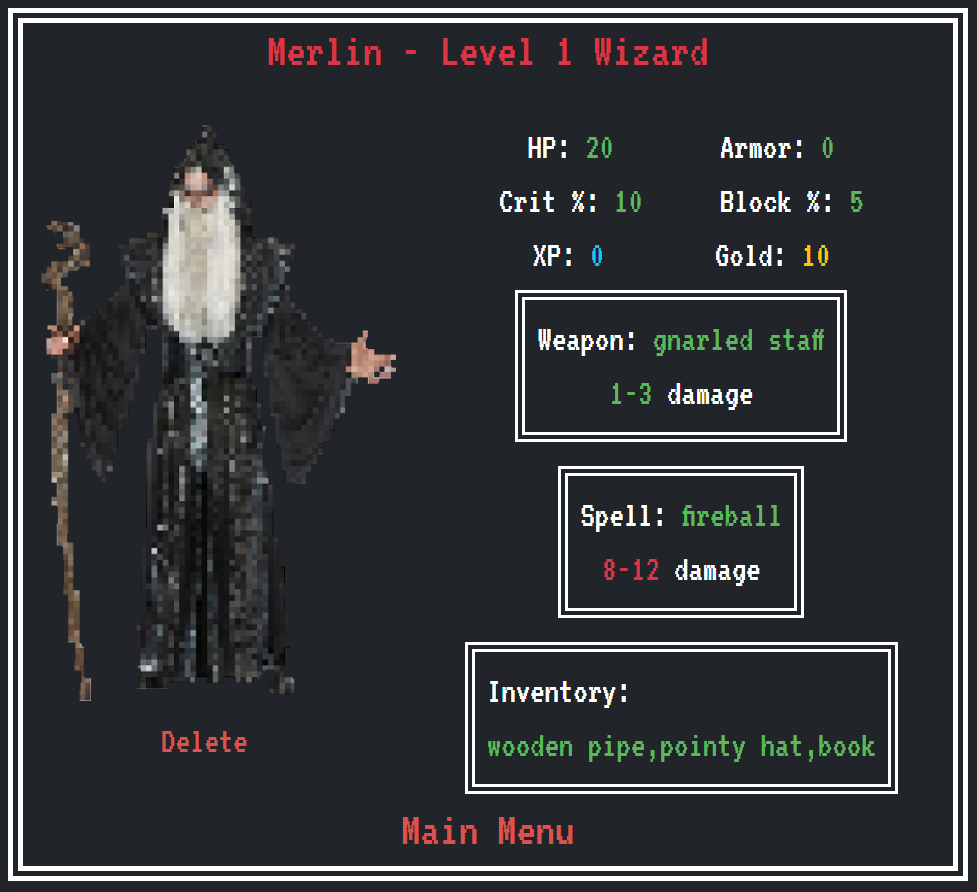
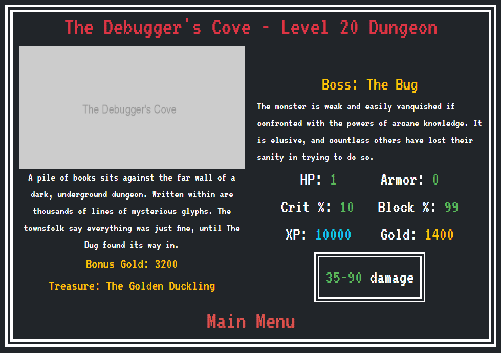
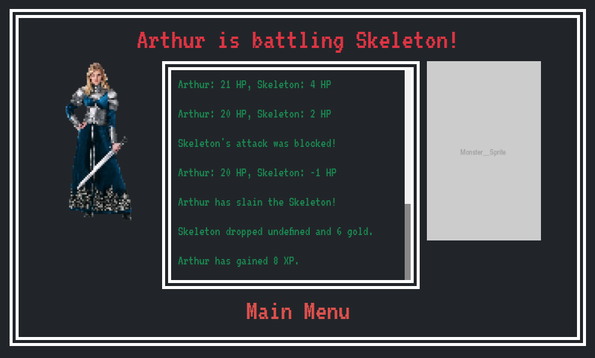

# Castles & Coding

Text-based role-playing in Node.js with MongoDB & Mongoose.

It makes extensive use of Javascript's prototype, while loops, and the Math object, to provide the basis of a classic tabletop roleplaying experience. 

```
As a longtime fan of tabletop gaming and computer roleplaying games, C&C is an homage 
to classic text-based roleplaying games of the past.
```

A front end, playable from the browser and themed afetr classic text-based role playing games, is currently under development. 

## Text-Based Character & Monster Creation

Players can create personalized hero and monster characters complete with their own stats, equipment, inventory, and gold.

Monsters can also be randomly generated and will scale with the hero's stats - the stronger the hero, the more fearsome the monsters will be.

## Combat and Loot System

Players can battle a specific hero against a specific monster one time, or battle against randomly-generated monsters over and over again until the hero is defeated.

Records of each battle are displayed in the console, and kept in the database for later viewing.

The combat system includes random chances for both heroes and monsters to block attacks or land critical hits. 

Monsters will drop gold, xp and items upon defeat, which will then transfer to the hero's inventory. Heroes level-up from experience, gain stats, and can equip new items they gain from battles.

## Design and Raid Your Own Dungeons

Players can create their own dungeons, with unique descriptions, dungeon bosses, treasures, and minions within.

Heroes can form a party in order to confront the powerful boss of a dungeon as a group. The party gains various bonuses based upon its makeup, then raids the dungeon as a group.  

## Town & Marketplace

Visit the town, where heroes can enter a shop to buy and sell items to non-player characters.

## Instructions

Clone the repository, and in the root directory
```
npm install
```

In your MongoDB shell, create a database called 
```
cncDb
```

Navigate to to ./seeds
```
node seed
```

To play in the browser:

navigate to the root directory:

```
node server
```


[Have fun storming the castle!](https://www.youtube.com/watch?v=AjUmULa0R-8)

## Character design

A tabletop RPG is less a of a game and more of a framework and set of tools - though seed data is provided for an example of play, you're encouraged to create your own heroes, monsters, and dungeons. You can modify the hero and monster stats and rewards calculations for a unique and endless experience. 

## Future Development

- Turn-based structure to the game for a more laid-back user experience. 

- Robust documentation for all aspects of how to play the game.






## From a Technical Standpoint

The game makes use of Express, MongoDB, and Express-Handblebars. It makes extensive use of dyanmic routing with mapped routes and req.params to put together the various database queries server side. Once the queries are assembled, the appropriate models are pulled from the database. The server makes extensive use of ES6, Javascript's prototype and the Math object to accomplish the basis of the role playing game's function in conjunction with asynchronous functions.

## Contributions

If you or anyone you know is interested in contributing pixel art, gameplay or design assets, or would simply like to know more about the project, contact me at nlamonaco86@gmail.com