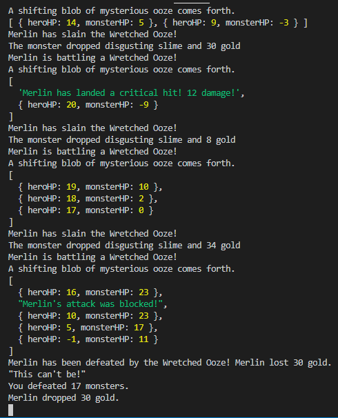
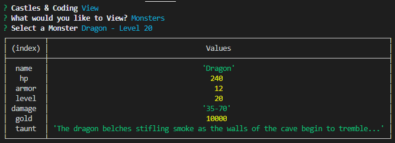

# Castles & Coding

Text-based role-playing in Node.js with MongoDB & Mongoose. It makes use of while loops and math to provide the basis of a classic tabletop roleplaying experience. 

```
As a longtime fan of tabletop gaming and computer roleplaying games, C&C is an homage to classic text-based roleplaying games of the past.
```

C&C is currently played entirely from the command line in your Node.js console. Future developments will include a front end inspired by MS-DOS era text-based games. 

## Text-Based Character and Monster Creation

Users can manually create hero and monster characters complete with their own stats, equipment, inventory, and gold, using the provided functions, all from Node.js.

Monsters can also be randomly generated and will scale with the hero's stats - the stronger the hero, the more fearsome the monsters will be.

Players can also create Non-Payer Characters with their own items, inventory, and things to say. 

## Combat and Loot System

Players can battle a specific hero against a specific monster one time, or battle against randomly-generated monsters over and over again until the hero is defeated.

Records of each battle are displayed in the console, and kept in the database for later viewing.

The "combat" system includes random chances for both heroes and monsters to block attacks or land critical hits. Monsters will drop gold and items upon defeat, which will then transfer to the hero's inventory. 

## Optional - No DB required

A simplified version of the game, requiring no database, is also provided.

## Instructions

Simply clone the repository, in your MongoDB shells, create a database called 

```
cncDb
```

Then, navigate to to ./CLI
```
node cnc
```

[Have fun storming the castle!](https://www.youtube.com/watch?v=AjUmULa0R-8)

## Future Development
- Battle multiple heroes against a single, more powerful monster i.e. a Dragon.
- More extensive combat system, incorporating spells and more.

- Create a front-end UI styled after classic text-based role-playing computer games.  
- Turn-based structure to the game for a more laid-back user experience. 

- Robust documentation for all aspects of the game.



